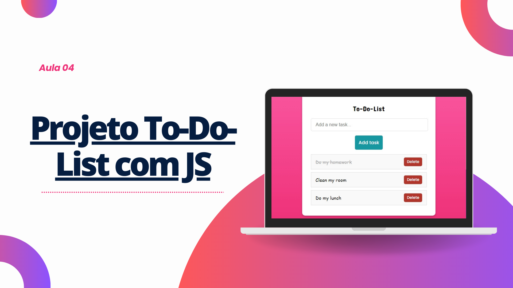

 

## 🖥️ Projeto

Este é um simples projeto de uma lista de tarefas (to-do list) desenvolvido usando HTML, CSS e JavaScript. A aplicação permite que os usuários adicionem tarefas, marquem como concluídas, tracem e removam as tarefas da lista.

### 🔎 Tecnologias

Esse projeto foi desenvolvido com as seguintes tecnologias:

- HTML
- CSS
- JavaScript
- Github

## 🎨 Instruções

- Para adicionar uma nova tarefa, digite o nome da tarefa na caixa de texto na parte superior da página.
- Pressione a tecla "Enter" ou clique no botão "Add" para adicionar a tarefa à lista.
- Ao clicar na caixa de seleção ao lado de uma tarefa, ela será marcada como concluída. A tarefa terá uma linha sobre ela para indicar que foi concluída.
- Para remover uma tarefa da lista, clique no botão "Delete" ao lado da tarefa que você deseja excluir. A tarefa será removida imediatamente da lista.

### 🧑‍💻 Creditos

Projeto feito em sala da [Infinity School](https://infinityschool.com.br/).

Professor [Luan Oliveira](https://www.linkedin.com/in/luanpdd/).